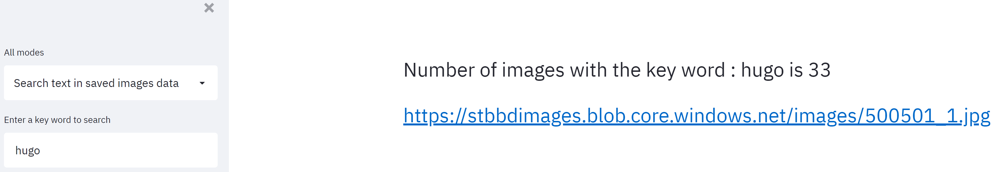
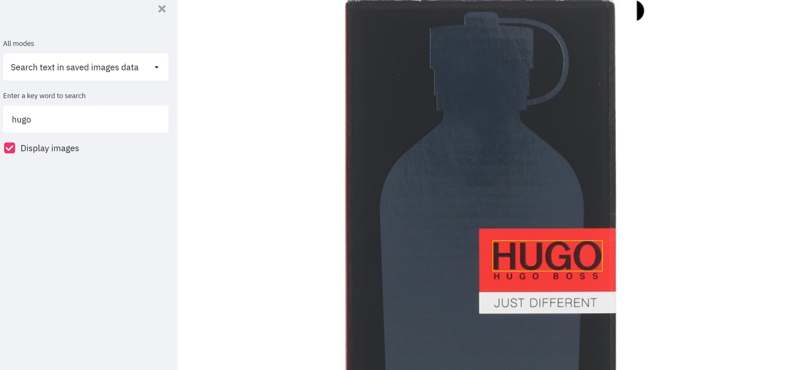
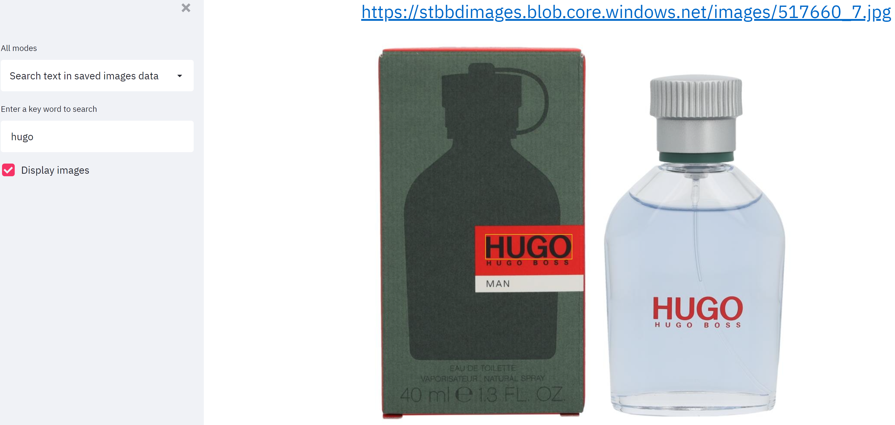

# Text recognizer using Azure Cognitive Services

### Info
* A simple application developed using streamlit and Azure Cognitive Services for the [Beta Business Days 2022 - B & S Case Study](https://www.betabusinessdays.nl/activities/case-bs-group/) held during March 2022 at Groningen, the Netherlands
* Won the best solution award
* Not all functionalities were developed during the 3 hour case study, some functionalities were added later
* The functionalities include recognizing text in image using Azure Cognitive Services and Computer Vision APIs and search for images containing the text given an input search key

### Instructions to run
```
streamlit run src/bs_image_text_recognizer_app.py
```

### Screenshots
* The following screenshots show a few sample images with bounding box drawn on the image highlighting the search keyword which was found in that image
***

***

***

